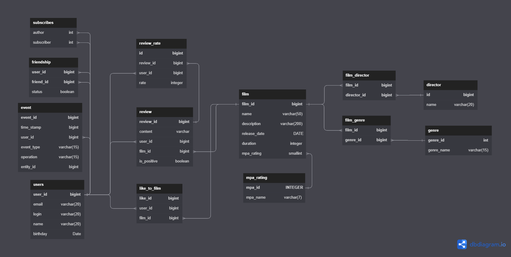

# java-filmorateTeam

## Командный проект.Команда #6

Все ветки на данный момент слиты в ветку develop. 
Ниже расписаны изменения, внесенные в проект.
---
Добавлена функциональность  «Отзывы»
путем реализации задания в ветке add-reviews была добавлена возможность оставить отзыв с рейтинго и несколькими дополнительными характеристиками.
1. Оценка — полезно/бесполезно.
2. Тип отзыва — негативный/положительный.
3. Рейтинг отзыва
### API
`POST /reviews`
Добавление нового отзыва.
`PUT /reviews`
Редактирование уже имеющегося отзыва.
`DELETE /reviews/{id}`
Удаление уже имеющегося отзыва.
`GET /reviews/{id}`
Получение отзыва по идентификатору.
`GET /reviews?filmId={filmId}&count={count}`
Получение всех отзывов по идентификатору фильма, если фильм не указан то все. Если кол-во не указано то 10.
- `PUT /reviews/{id}/like/{userId}`  — пользователь ставит лайк отзыву.
- `PUT /reviews/{id}/dislike/{userId}`  — пользователь ставит дизлайк отзыву.
- `DELETE /reviews/{id}/like/{userId}`  — пользователь удаляет лайк/дизлайк отзыву.
- `DELETE /reviews/{id}/dislike/{userId}`  — пользователь удаляет дизлайк отзыву.

Добавлена функциональность «Поиск»
путем реализации задания в ветке add-search была добавлена возможность поиск по названию фильмов и по режиссёру.
### API
`GET /fimls/search`
Возвращает список фильмов, отсортированных по популярности.
**Параметры строки запроса**
`query` — текст для поиска
`by` — может принимать значения `director` (поиск по режиссёру), `title` (поиск по названию), либо оба значения через запятую при поиске одновременно и по режиссеру и по названию.

Добавлена функциональность «Общие фильмы»
путем реализации задания в ветке add-common-films была добавлена возможность вывода общих с другом фильмов с сортировкой по их популярности.
### API
`GET /films/common?userId={userId}&friendId={friendId}`
Возвращает список фильмов, отсортированных по популярности.
**Параметры**
`userId` — идентификатор пользователя, запрашивающего информацию;
`friendId` — идентификатор пользователя, с которым необходимо сравнить список фильмов.

Добавлена функциональность «Рекомендации»
путем реализации задания в ветке add-recommendations была добавлена возможность простой рекомендательной системы для фильмов..
### API
`GET /films/common?userId={userId}&friendId={friendId}`
Возвращает список фильмов, отсортированных по популярности.
**Параметры**
`userId` — идентификатор пользователя, запрашивающего информацию;
`friendId` — идентификатор пользователя, с которым необходимо сравнить список фильмов.

Добавлена функциональность «Лента событий»
путем реализации задания в ветке add-feed была добавлена возможность просмотра последних событий на платформе — добавление в друзья, удаление из друзей, лайки и отзывы, которые оставили друзья пользователя.
### API
`GET /users/{id}/feed`
Возвращает ленту событий пользователя.

Добавлена функциональность "Удаление фильмов и пользователей"
путем реализации задания в ветке add-remove-endpoint была добавлена функциональность для удаления фильма и пользователя по идентификатору.
### API
`DELETE /users/{userId}`
Удаляет пользователя по идентификатору.
`DELETE /films/{filmId}`
Удаляет фильм по идентификатору.

Добавлена функциональность "Добавление режиссёров в фильмы"
путем реализации задания в ветке add-director была добавлена возможность дополнить информацию о фильмах именем режиссёра.
После этого должна появилась следующая функциональность:
1. Вывод всех фильмов режиссёра, отсортированных по количеству лайков.
2. Вывод всех фильмов режиссёра, отсортированных по годам.
### API
`GET /films/director/{directorId}?sortBy=[year,likes]`
Возвращает список фильмов режиссера отсортированных по количеству лайков или году выпуска.
`POST /films`
`GET /directors` - Список всех режиссёров
`GET /directors/{id}`- Получение режиссёра по id
`POST /directors` - Создание режиссёра
`PUT /directors` - Изменение режиссёра
`DELETE /directors/{id}` - Удаление режиссёра

Добавлена функциональность "Вывод самых популярных фильмов по жанру и годам"
путем реализации задания в ветке add-most-populars была добавлена возможность выводить топ-N фильмов по количеству лайков.
Фильтрация должна быть по двум параметрам.
1. По жанру.
2. За указанный год.
### API
`GET /films/popular?count={limit}&genreId={genreId}&year={year}`
Возвращает список самых популярных фильмов указанного жанра за нужный год.

# Схема базы данных

